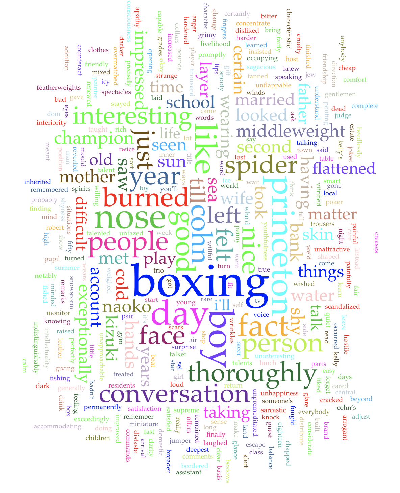
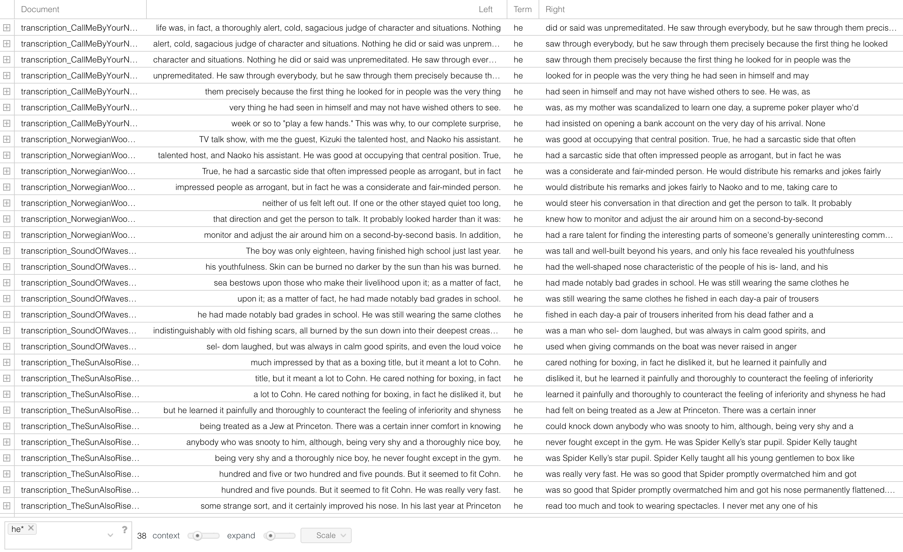
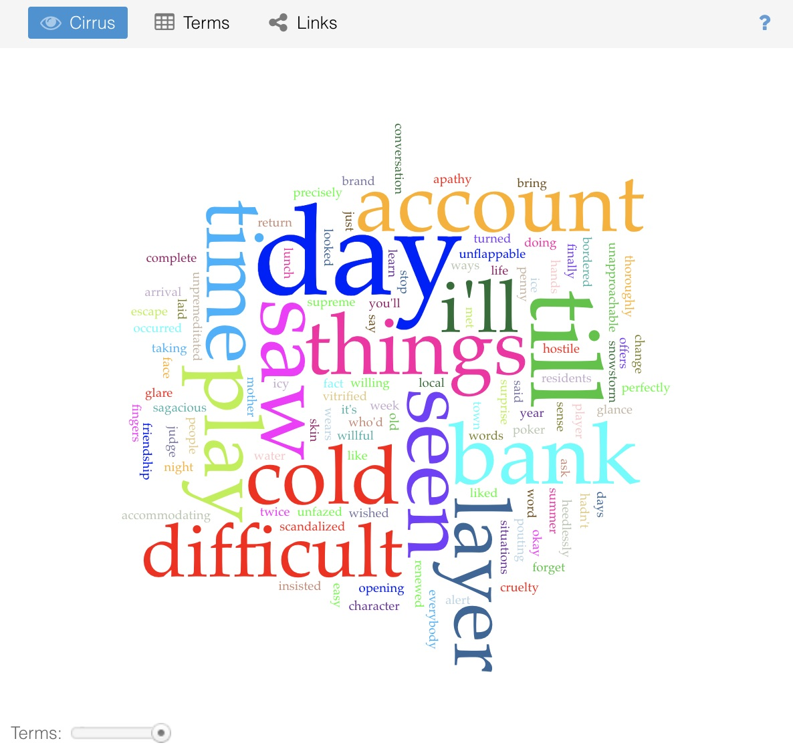
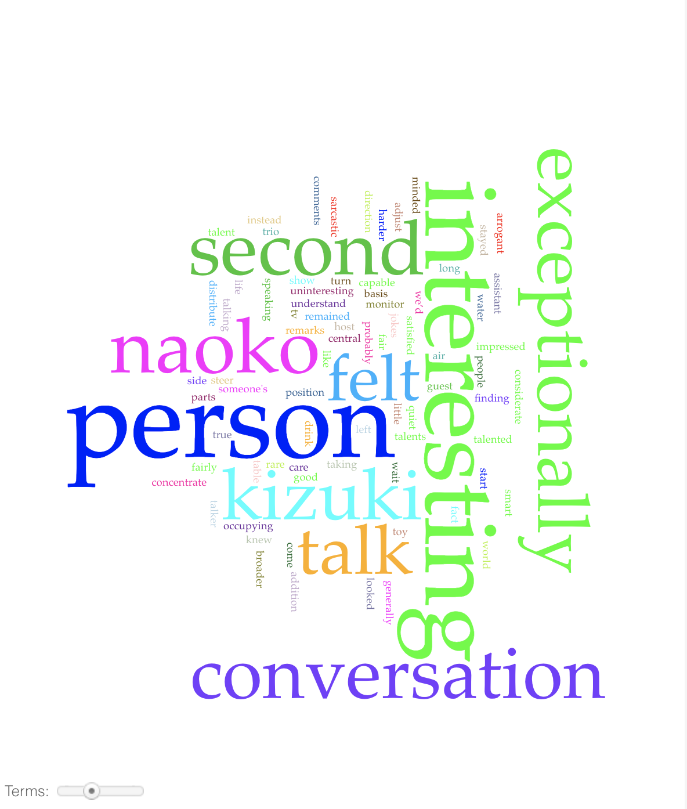
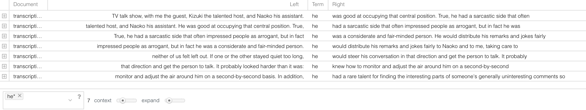
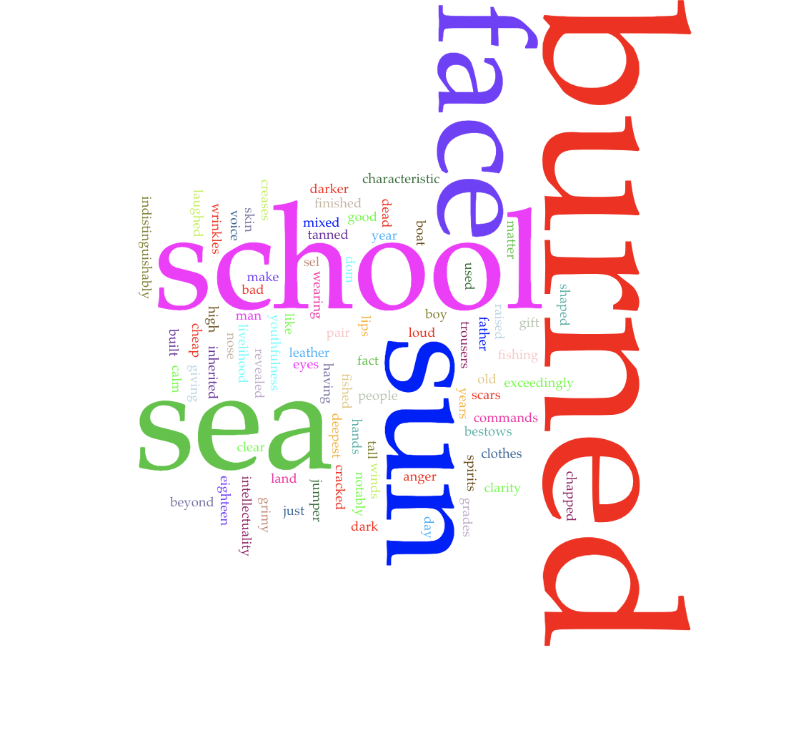

# Analysis and Findings

The analysis from the project is broken down into 5 sections: 1 section for the analysis of the whole corpus, examaning commonalites and trends amongst all 4 novels within a digital text analysis tool called Voyant, and then 1 section dedicated to each novel. 

### Key Terms

- **Voyant**: A digital text analysis tool which was the primary tool used for the project.
- **Corpus**: A collection of written texts. In this case, the collection of all 4 novel passages.
- **Cirrus tool**: A tool within Voyant which shows a word cloud created to display frequent words within a text
- **Context tool**: A tool within Voyant which shows the contexts in which a given term appears. Context is givven for text to the left and the right of the given term.

---

# Corpus Analysis

Analysis of the corpus (all 4 novels together) is the true meat of the project. Because of small passage sizes, individual examinations of each novels, while still worthwhile, did not produce the sort of insights which this project focuses on. On the other hand, when all 4 novels are analyzed together, we begin to see a series of commonalities. The primary one being that yes, these 4 books and their passages introducing significant male characters do seem to describe the character as fitting in with traditional, masculine ideals. While this was not a surprise, the way in which these 4 novels did so was.

### Expertise and Command

When analyzing the descriptors of the 4 characters, we notice something quite interesting. Each novel has a tendency to assign a degree of expertise and command in different areas to each of the characters. Common descriptors for the caracters were words such as "exceptionally," "talented," "interesting," and "exceedingly." 

In the case of **Robert Cohn** in *The Sun also Rises,* his prowess and success as a boxing champion is highlighted in his introduction, and area which he was the top of his class in. In **Oliver's** case in *Call Me by Your Name,* his ability to read and charm people is his area of prowess. 
But no matter what area each character was described as being exceedingly well in, one aspect was described as an area of excellence in all the characters: **the ability to command attention and lead social interactions.** This is most evident in **Kizuki's** case in *Norwegian Wood,* where he is described as having the qualities of a "TV host."

### Traditional Ideals of Masculinity

The commonalities don't stop at the idea of expertise. In addition, we see each novel describe the analyzed character in a way that fits the ideals of a traditional and toxic view of masculinity. 

When describing their physical appearance, they are often given characteristics such as being tall, built physically strong, and having stoic physical expressions. But we seem heteronormative and traditional traits within the descriptions of their mental and emotional character as well. Looking at the word cloud in the Cirrus tool, we see identifiers such as being emotionally cold, analytical, and emotionally reserved. These all fit the idea than men, or masculinity, should be defined by a degree of detachement from emotions, and approaching situations and life with a more "logical" perspective. 

We see this present in terms such as "**hardened**," "**unapproachable**," "**sagacious**," and "**unfazed**."

The terms present within the word cloud show the reinforcement of these traits across the entire corpus.

---

# *Call Me by Your Name*

*Call Me by Your Name* presents an interesting situation within the project. 
The novel explores situations, relationships, and subject matters which directly contradict heteronormative standards of masculinity. Therefore, it is reasonable to hypothesize that the traditional traits of masculinity would either be minimized here or completely absent. However, that was not the case.

The character whose introduction and description was analyzed here was **Oliver**, given that he is the second primary character following Elio. While the book does challenge heteronormativity, Oliver is still described as having a personality and appearance as presenting in line with traditional masculine stereotypes.

In the analyzed passage, Oliver is described as being quite a dominating force. The word cloud shows the key terms '**cold**," "**difficult**," and "**hostile**," which are used in the text to describe Oliver's demeanor. 

He's also described as being able to see into other's deeply and essentially see through any facades, a trait which aligns with the idea of these character's having a strong social command. All of these add up to a fairly traditional presentation of masculinity: a tall and large physical appearance, an intimidating/dominating presence, and a stoic emotional presentation.

Oliver is an interesting case, as Elio often describes his character and demeanor from an aspirational perspective.

---

# *Norwegian Wood*

In *Norwegian Wood*, the character analyzed was **Kizuki**, the main character's best friend who died prior to the start of the novel.
Kizuki's physical characteristics are never described, however, his introductory passage presents his personality and social skills thoroughly.

Kizuki is presented in a less obviously demanding way than Oliver is in *Call Me by Your Name*. Instead, he is described as having a warmer personality. Descriptors such as "**considerate**" are key here. But significant focus is still put on his ability to lead a conversation and social setting. Here, the key descriptors are ones such as "**capable**," "**interesting**," and "**exceptionally**." The term "**arrogant**" is also of note, however, when read in context, Kizuki is not described as *being* arrogant, but rather as *appearing* that way to those who do not know him well.

In the contexts tool, we see the search term "he" giving contexts in phrases which overwhelmingly focus on his ability to command conversations.

While Kizuki is presented as having a different form of dominance than Oliver, he is still attributed a degree of high confidence and leadership seen throughout the corpus.

---

# *The Sound of Waves*

For *The Sound of Waves*, the character analyzed was a boy who reoccurs throughout the novel, but is never named. Asside from the narrator, he is the second male character to receive the most amount of description, as the novel primarily focuses on the narrator and a female protagonist.

In the passage of his introduction, he is spotted by the narrator working on a fishing boat with a small crew. Physically, the key descriptors are "**tall**" and "**well-built**," describing a visual of a blue-collar man we've seen many times throughout fiction. He is described as having th physical build of a man many years older than his own 18 year old self, an ideal which is often unattainable to many.

The description goes further into this hyper-masculine character by describing his face as "**burned**" and "**cracked**" despite looking youthful at the same time. His social character is attributed a booming, commanding voice as well, yet again aiding in the trend of **leadership** and **command** across the study.

---

# *The Sun Also Rises*

In *The Sun Also Rises*, the transcribed passage is the introduction of the character **Robert Cohn**, the narrator's close friend in the novel and the second most prominent male character. This introduction is, by far, the most blatant expression of expertise and prowess amongst the 4 novels. Given that it is Hemingway, it is of no surprise that Cohn is described as having highly traditional, masculine traits. 

The key descriptors here are "**boxing**," "**champion**," and surprisingly, "**nice**."

